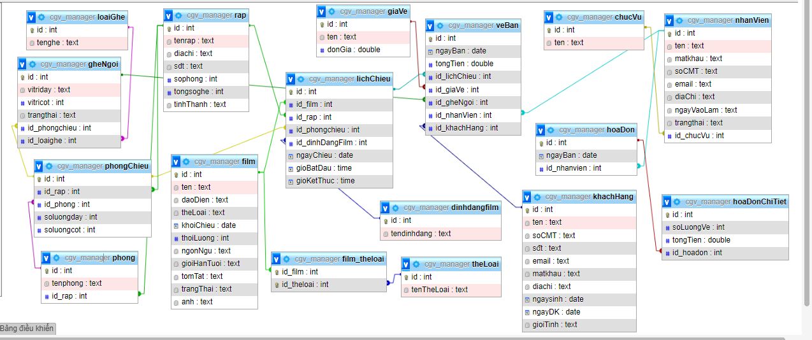
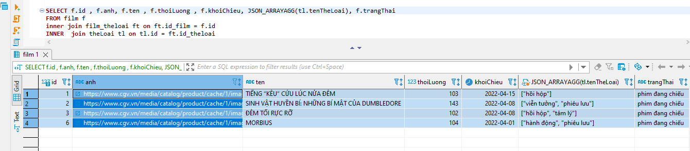
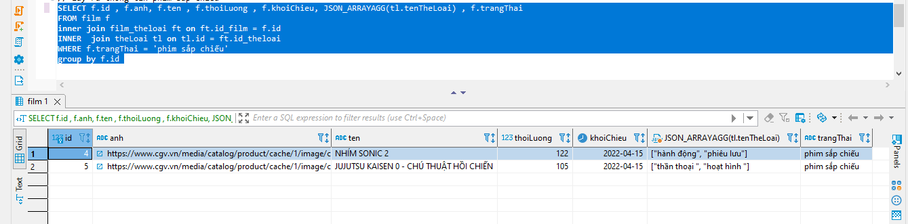
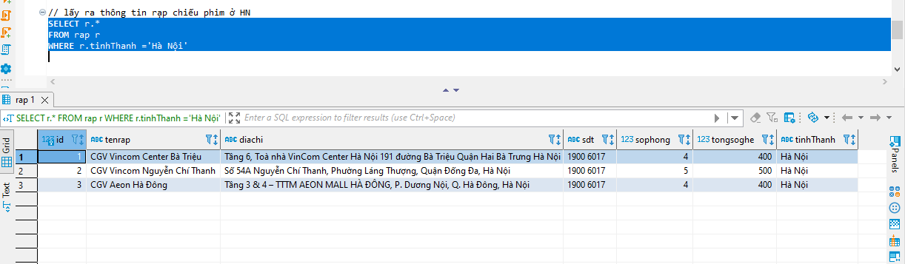
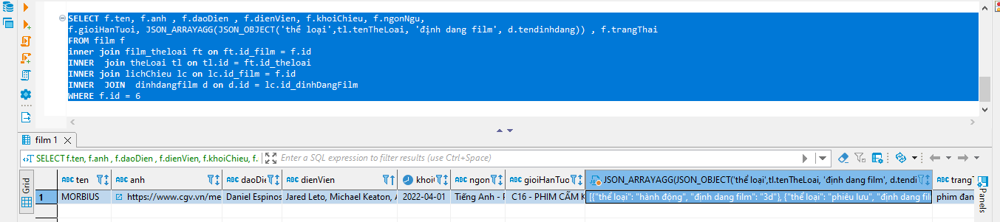

## quản lý rạp cgv

**tạo bảng**

*tạo bảng thể loại*
```sql
CREATE TABLE theLoai (
  id int PRIMARY KEY  AUTO_INCREMENT,
  tenTheLoai text NOT NULL
)
```

*tạo bảng film*
```sql
CREATE TABLE film (
  id int PRIMARY KEY AUTO_INCREMENT,
  ten text NOT NULL,
  daoDien text NOT NULL,
  khoiChieu date NOT NULL,
  thoiLuong int NOT NULL,
  ngonNgu text NOT NULL,
  gioiHanTuoi text NOT NULL,
  tomTat text NOT NULL,
  trangThai text NOT NULL,
  anh text NOT NULL,
  dienVien text NOT NULL
)
```

*tạo bảng theloai_film*

```sql
CREATE TABLE film_theloai (
  id_film int NOT NULL,
  id_theloai int NOT NULL,
  PRIMARY KEY (id_film, id_theloai),
  FOREIGN KEY (id_film) REFERENCES film(id),
  FOREIGN KEY (id_theloai) REFERENCES theLoai(id)
) 
```

*tạo bảng rạp*
```sql
CREATE TABLE rap (
  id int PRIMARY KEY AUTO_INCREMENT,
  tenrap text NOT NULL,
  diachi text NOT NULL,
  sdt text NOT NULL,
  sophong int NOT NULL,
  tongsoghe int NOT NULL,
  tinhThanh text,
) 
```
*tạo bảng phòng*
```sql
CREATE TABLE phong (
  id int PRIMARY KEY AUTO_INCREMENT,
  tenphong text NOT NULL,
  id_rap int,
  FOREIGN KEY (id_rap) REFERENCES rap(id)
)
```

*tạo bảng phòng chiếu*
```sql
CREATE TABLE phongChieu (
  id int PRIMARY KEY  AUTO_INCREMENT,
  id_rap int,
  id_phong int,
  soluongday int NOT NULL,
  soluongcot int NOT NULL,
  FOREIGN KEY (id_rap) REFERENCES rap(id),
  FOREIGN KEY (id_phong) REFERENCES phong(id)
) 
```

*tạo bảng loại ghế*
```sql
CREATE TABLE loaiGhe (
  id int PRIMARY KEY AUTO_INCREMENT,
  tenghe text NOT NULL
) 
```
*tạo bảng ghế ngồi*
```sql
CREATE TABLE gheNgoi (
  id int PRIMARY KEY AUTO_INCREMENT,
  vitriday text NOT NULL,
  vitricot int NOT NULL,
  trangthai text NOT NULL,
  id_phongchieu int,
  id_loaighe int,
  FOREIGN KEY (id_phongchieu) REFERENCES phongChieu(id),
  FOREIGN KEY (id_loaighe) REFERENCES loaiGhe(id)
)
```
*tạo bảng định dang phim*
```sql
CREATE TABLE dinhdangfilm (
  id int PRIMARY KEY AUTO_INCREMENT,
  tendinhdang text NOT NULL
)
```
*tạo bảng lịch chiếu*
```sql
CREATE TABLE lichChieu (
  id int PRIMARY KEY  AUTO_INCREMENT,
  id_film int NOT NULL,
  id_rap int NOT NULL,
  id_phongchieu int NOT NULL,
  id_dinhDangFilm int NOT NULL,
  ngayChieu date NOT NULL,
  gioBatDau time NOT NULL,
  gioKetThuc time NOT NULL,
  FOREIGN KEY (id_film) REFERENCES film(id),
  FOREIGN KEY (id_rap) REFERENCES rap(id),
  FOREIGN KEY (id_phongchieu) REFERENCES phongChieu(id),
  FOREIGN KEY (id_dinhDangFilm) REFERENCES dinhdangfilm(id)
)
```
*tạo bảng giá vé*
```sql
CREATE TABLE giaVe (
  id int PRIMARY KEY AUTO_INCREMENT,
  ten text NOT NULL,
  donGia double NOT NULL
)
```

*tạo bảng chức vụ
```sql
CREATE TABLE chucVu (
  id int  PRIMARY KEYAUTO_INCREMENT,
  ten text NOT NULL
)
```
*tạo bảng nhân viên*
```sql
CREATE TABLE nhanVien (
  id int PRIMARY KEY AUTO_INCREMENT,
  ten text NOT NULL,
  matkhau text NOT NULL,
  soCMT text NOT NULL,
  email text NOT NULL,
  diaChi text NOT NULL,
  ngayVaoLam text NOT NULL,
  trangthai text NOT NULL,
  id_chucVu int DEFAULT NULL,
  FOREIGN KEY (id_chucVu) REFERENCES chucVu(id)
)
```
*tạo bảng khách hàng*
```sql
CREATE TABLE khachHang (
  id int PRIMARY KEY  AUTO_INCREMENT,
  ten text NOT NULL,
  soCMT text NOT NULL,
  sđt text NOT NULL,
  email text NOT NULL,
  matkhau text NOT NULL,
  diachi text NOT NULL,
  ngaysinh date,
  ngayDK date NOT NULL,
  gioiTinh text
)
```
*tạo bảng vé bán*
```sql
CREATE TABLE veBan (
  id int PRIMARY KEY AUTO_INCREMENT,
  ngayBan date NOT NULL,
  tongTien double NOT NULL,
  id_lichChieu int,
  id_giaVe int,
  id_gheNgoi int,
  id_nhanVien int,
  id_khachHang int,
  FOREIGN KEY (id_lichChieu) REFERENCES lichChieu(id),
  FOREIGN KEY (id_giaVe) REFERENCES giaVe(id),
  FOREIGN KEY (id_gheNgoi) REFERENCES gheNgoi(id),
  FOREIGN KEY (id_nhanVien) REFERENCES nhanVien(id),
  FOREIGN KEY (id_khachHang) REFERENCES khachHang(id)
)
```

*tạo bảng hóa đơn*
```sql
CREATE TABLE hoaDon (
  id int PRIMARY KEY ,
  ngayBan date NOT NULL,
  id_nhanvien int,
  FOREIGN KEY (id_nhanVien) REFERENCES nhanVien(id)
)
```
*tạo bảng hóa đơn chi tiết*
```sql
CREATE TABLE hoaDonChiTiet (
  id int PRIMARY KEY ,
  soLuongVe int NOT NULL,
  tongTien double,
  id_hoadon int,
  FOREIGN KEY (id_hoadon) REFERENCES hoaDon(id)
)
```
 ## bộ thiết kế  

    


 ## Viết query

**lấy ra thông tin các phim đang chiếu**
```sql
SELECT f.id , f.anh, f.ten , f.thoiLuong , f.khoiChieu, JSON_ARRAYAGG(tl.tenTheLoai), f.trangThai  
FROM film f 
inner join film_theloai ft on ft.id_film = f.id 
INNER  join theLoai tl on tl.id = ft.id_theloai 
WHERE f.trangThai = 'phim đang chiếu'
group by f.id 
```
   


**lấy ra thông tin phim sắp chiếu**
```sql
SELECT f.id , f.anh, f.ten , f.thoiLuong , f.khoiChieu, JSON_ARRAYAGG(tl.tenTheLoai) , f.trangThai
FROM film f 
inner join film_theloai ft on ft.id_film = f.id 
INNER  join theLoai tl on tl.id = ft.id_theloai 
WHERE f.trangThai = 'phim sắp chiếu'
group by f.id 
```
  

**lấy ra các rạp ở HN**

```sql
SELECT r.*
FROM rap r 
WHERE r.tinhThanh ='Hà Nội'
```
  

**lấy thông tin 1 bộ phim đang chiếu**
```sql
SELECT f.ten, f.anh , f.daoDien , f.dienVien, f.khoiChieu, f.ngonNgu, 
f.gioiHanTuoi, JSON_ARRAYAGG(JSON_OBJECT('thể loại',tl.tenTheLoai, 'định dang film', d.tendinhdang)) , f.trangThai
FROM film f 
inner join film_theloai ft on ft.id_film = f.id 
INNER  join theLoai tl on tl.id = ft.id_theloai 
INNER join lichChieu lc on lc.id_film = f.id 
INNER  JOIN  dinhdangfilm d on d.id = lc.id_dinhDangFilm 
WHERE f.id = 6
```

